# Beloop ERP - Workflow & Business Rules Documentation

## 6. Complete Workflow Diagrams

### 6.1 Order Lifecycle (Creation → Fulfillment → Payment)

```mermaid
sequenceDiagram
    participant Staff
    participant POS as POS App
    participant API as tRPC API
    participant Inngest as Inngest Worker
    participant DB as PostgreSQL
    participant Ledger as Financial Ledger

    rect rgb(40, 40, 50)
        Note over Staff,POS: 1. ORDER CREATION
        Staff->>POS: Add items to cart
        Staff->>POS: Apply discount (optional)
        Staff->>POS: Select customer (optional)
    end

    rect rgb(50, 40, 40)
        Note over POS,Inngest: 2. PAYMENT & SYNC
        Staff->>POS: Select payment method(s)
        POS->>API: pos.syncSales(order)
        API->>Inngest: Queue "pos/sale.created"
        API-->>POS: {status: "queued"} ✅
    end

    rect rgb(40, 50, 40)
        Note over Inngest,Ledger: 3. ASYNC PROCESSING
        Inngest->>DB: Check idempotency key
        Inngest->>DB: Create Order + OrderItems
        Inngest->>DB: Create OrderPayments (if split)
        Inngest->>DB: Deduct stock (recipe-aware)
        Inngest->>DB: Create StockMove records
        Inngest->>Ledger: Post Revenue entry
        Inngest->>Ledger: Post COGS entry
    end

    rect rgb(50, 50, 40)
        Note over POS,Staff: 4. KITCHEN DISPLAY
        POS->>API: Order has kitchenStatus: NEW
        Note right of API: Kitchen sees order
        API->>DB: Update kitchenStatus: PREPARING
        API->>DB: Update kitchenStatus: READY
        Note right of Staff: Staff delivers order
    end
```



### 6.2 Order Void Flow

```mermaid
sequenceDiagram
    participant Manager
    participant POS as POS App
    participant API as tRPC API
    participant DB as PostgreSQL

    Manager->>POS: Select completed order
    Manager->>POS: Enter void reason
    POS->>API: pos.voidOrder(orderId, reason)
    
    API->>DB: BEGIN TRANSACTION
    API->>DB: Verify order belongs to outlet
    API->>DB: Restore product stock (+qty)
    API->>DB: Create StockMove (ADJUSTMENT)
    API->>DB: Update order.status = VOIDED
    API->>DB: Create AuditLog
    API->>DB: COMMIT
    
    API-->>POS: Order voided ✅
```



### 6.3 Inventory Management Flow


### 6.4 Stock Count / Verification Flow

```mermaid
sequenceDiagram
    participant Staff
    participant POS
    participant API
    participant DB

    Staff->>POS: Open Stock Count
    POS->>API: Get current stock levels
    Staff->>POS: Count physical items
    Staff->>POS: Enter counted quantities
    POS->>API: pos.createStockCount(items)
    
    loop For each item
        API->>DB: Get product.currentStock
        API->>DB: Calculate difference
        API->>DB: Create StockCheckItem
        alt Difference != 0
            API->>DB: Update product.currentStock
            API->>DB: Create StockMove (ADJUSTMENT)
        end
    end
    
    API->>DB: Invalidate cache
    API-->>POS: Stock count saved ✅
```



### 6.5 Multi-Outlet Transfers

> ⚠️ **NOT YET IMPLEMENTED**


**Gap Analysis:** No `StockTransfer` table or transfer routers exist. Recommended tables:
```sql
-- Proposed
StockTransfer: id, fromOutletId, toOutletId, status, items[]
StockTransferItem: productId, qty, transfer
```

### 6.6 Returns/Refunds Process

> ⚠️ **NOT YET IMPLEMENTED**


**Gap Analysis:** Current void only supports:
- Full order cancellation (no partial item refund)
- Stock restoration
- Audit logging

Missing:
- `Refund` table
- Partial refund logic
- Payment gateway reversal
- Ledger reversal entries

---

## 7. Business Rules Document

### 7.1 Pricing Logic

| Rule | Implementation | Location |
|------|----------------|----------|
| **Product Price** | Stored in `Product.price` | `schema.prisma` |
| **Price Display** | Front-end formats with currency | POS components |
| **No Tax Calculation** | Tax field exists but defaults to 0 | `Order.tax` |
| **Discount Application** | Applied after subtotal | `Order.discount` |

### 7.2 Discount System

```typescript
// Discount Types (from schema)
Discount {
    code: string      // "WELCOME10"
    type: "PERCENTAGE" | "FIXED"
    value: Decimal    // 10 or 50.00
    minOrderVal: Decimal
    maxDiscount: Decimal?  // Cap for percentage
    usageLimit: int?
    usedCount: int
}
```

**Discount Application Rules:**
1. Check `isActive` = true
2. Check date range (`startDate` to `endDate`)
3. Validate `order.subtotal >= minOrderVal`
4. Calculate discount:
   - FIXED: `discount = value`
   - PERCENTAGE: `discount = min(subtotal * value/100, maxDiscount)`
5. Increment `usedCount`
6. Check `usedCount < usageLimit` (if limit set)

### 7.3 Loyalty Program

```typescript
LoyaltyRule {
    minSpendPerVisit: Decimal  // ₹500 minimum
    visitsRequired: int        // 6 visits
    rewardType: "PERCENTAGE" | "FLAT"
    rewardValue: Decimal       // 10% or ₹100
}

LoyaltyProgress {
    stamps: int          // Current visit count
    totalSpend: Decimal  // Lifetime spend
}
```

**Loyalty Rules:**
1. Each order with `total >= minSpendPerVisit` = 1 stamp
2. At `visitsRequired` stamps → reward unlocked
3. Reward applied as discount on next order
4. Stamps reset after reward redemption

### 7.4 Tax Calculations

> ⚠️ **NOT IMPLEMENTED - Defaults to 0**

**Current State:**
- `Order.tax` field exists (Decimal)
- Always set to `0` in code
- No GST/VAT calculation logic

**Proposed Implementation:**
```typescript
// Suggested future implementation
const GST_RATE = 0.05; // 5% GST
const order.tax = order.subtotal * GST_RATE;
const order.totalAmount = order.subtotal - order.discount + order.tax;
```

### 7.5 Payment Methods

| Method | Code | Stock Deduction | Ledger Entry |
|--------|------|-----------------|--------------|
| Cash | `CASH` | ✅ Immediate | Debit: Cash on Hand |
| Card | `CARD` | ✅ Immediate | Debit: Bank Account |
| UPI | `UPI` | ✅ Immediate | Debit: Bank Account |
| Split | `SPLIT` | ✅ Immediate | Multiple entries |

### 7.6 Kitchen Status Flow

```
NEW → PREPARING → READY → SERVED (implicit via COMPLETED)
```

| Status | Trigger | Display |
|--------|---------|---------|
| `NEW` | Order created | 🔴 New order alert |
| `PREPARING` | Kitchen starts | 🟡 In progress |
| `READY` | Kitchen completes | 🟢 Ready for pickup |
| `SERVED` | N/A (order delivered) | - |

---

## 8. Integration Points

### 8.1 Current Integrations

| Service | Purpose | Config | Status |
|---------|---------|--------|--------|
| **Clerk** | Authentication | `CLERK_SECRET_KEY` | ✅ Active |
| **Neon PostgreSQL** | Primary Database | `DATABASE_URL` | ✅ Active |
| **Upstash Redis** | Caching | `UPSTASH_REDIS_*` | ✅ Active |
| **Inngest** | Background Jobs | `INNGEST_*` | ✅ Active |
| **Resend** | Transactional Email | `RESEND_API_KEY` | ✅ Active |
| **Sentry** | Error Tracking | Built-in | ✅ Active |
| **Google Sheets** | Export Reports | OAuth + `googleapis` | ✅ Available |

### 8.2 Integration Architecture


### 8.3 Missing Integrations

| Integration | Purpose | Priority |
|-------------|---------|----------|
| **Payment Gateway** (Razorpay/Stripe) | Online payments | 🔴 High |
| **SMS Gateway** (MSG91/Twilio) | OTP, notifications | 🟡 Medium |
| **Accounting Software** (Tally/Zoho) | Export to accounting | 🟡 Medium |
| **Delivery Partners** (Swiggy/Zomato) | Order sync | 🟢 Low |
| **Printer SDK** (Bluetooth/USB) | Direct receipt print | 🟢 Low |

### 8.4 Google Sheets Integration

**Implemented Features:**
- Export daily sales to Google Sheets
- Spreadsheet ID stored in `Tenant.sheetsSpreadsheetId`
- OAuth refresh token in `Tenant.sheetsRefreshToken`
- Triggered via `googleSheets` router

**Not Implemented:**
- Two-way sync
- Real-time updates
- Automatic backup

---

## 9. Gap Analysis Summary

| Feature | Status | Effort to Implement |
|---------|--------|---------------------|
| **Order Refunds** | ❌ Missing | 4-6 hours |
| **Partial Refunds** | ❌ Missing | 4-6 hours |
| **Multi-Outlet Transfers** | ❌ Missing | 8-12 hours |
| **Tax Calculations** | ❌ Missing | 2-4 hours |
| **Payment Gateway** | ❌ Missing | 8-16 hours |
| **SMS Notifications** | ❌ Missing | 4-6 hours |
| **Accounting Export** | ❌ Missing | 8-12 hours |
| **Real-time KDS (WebSocket)** | ⚠️ Partial (polling) | 4-6 hours |

---

## 10. Recommended Next Steps

1. **Implement Tax Calculation** (Quick Win - 2hrs)
   - Add GST rate to Tenant settings
   - Calculate in order processing

2. **Add Refund System** (Medium - 6hrs)
   - Create Refund model
   - Add refund router
   - Ledger reversal entries

3. **Payment Gateway Integration** (High Priority - 16hrs)
   - Razorpay for India
   - Handle webhooks
   - Update Order.paymentStatus

4. **Multi-Outlet Transfers** (Future - 12hrs)
   - New StockTransfer model
   - Approval workflow
   - Cross-outlet stock tracking
