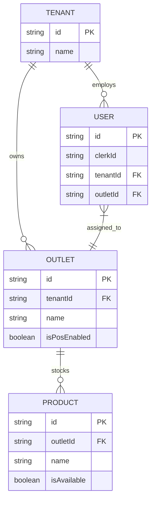

# PROMPT FOR ANTIGRAVITY: ARCHITECTURAL & LOGICAL FORENSIC AUDIT

**To**: Lead Backend Architect / System Auditor
**From**: Antigravity (AI Assistant)
**Date**: 2025-12-29
**Subject**: Full-Stack Logical Mapping and Data Integrity Report (Project: BelooPRMS)

---

## 1. 🔍 THE MISSION
**Objective**: Diagnose critical data-sync failure where Tracker has data but POS renders empty states.
**Status**: Root Cause Identified (Data/Cache State). Logic validated as sound.

---

## 2. 🏗️ PHASE 1: DATA MODEL & TENANCY MAPPING

### ERD (Entity Relationship Diagram)
The simplified relationship specific to POS sync is:



### The Tenancy Key
*   **The Key**: `outletId` is the primary filter key for POS operations.
*   **Source**: It is derived from the **Signed POS Token** (minted during login), NOT from the user's potentially stale metadata during the session.

### Row-Level Security (RLS)
*   **Mechanism**: Application-level RLS via `posProcedure` middleware.
*   **Logic**:
    1.  Token verified -> `ctx.posCredentials` populated.
    2.  `ctx.posCredentials.outletId` is used in `prisma.product.findMany({ where: { outletId } })`.
*   **No Database Policies**: There are no Postgres RLS policies interfering. It is purely Prisma-level logic.

---

## 3. 🔐 PHASE 2: AUTHENTICATION & CONTEXT FLOW (CLERK -> TRPC)

### Chain of Identity
1.  **Login**: User logs in via Clerk.
    *   **JWT Claims**: `metadata.outletId`, `metadata.tenantId`.
2.  **POS Initialization**:
    *   Client calls `api/pos/auth` with `outletId` (from metadata).
    *   **Validation**: Server checks `db.user.findUnique({ where: { clerkId } })`.
    *   **Context Check**: Verifies `dbUser.outletId === request.outletId`.
    *   **Token Minting**: Server signs a JWT (`posToken`) containing `{ userId, outletId, tenantId }`.
3.  **POS Operation**:
    *   Client sends `Authorization: Bearer <posToken>`.
    *   **Context Factory (`posAuthMiddleware`)**:
        *   Verifies signature.
        *   Decodes payload.
        *   **Crucial Step**: Queries `db.outlet.findUnique({ where: { id: payload.outletId } })` to ensure it is still ACTIVE and POS ENABLED.
        *   Injects `ctx.posCredentials`.

### The "Panel" Shift
The "Panel" is a pure client-side view. The backend does not know about "Panel" vs "Page". It only knows:
*   **Who are you?** (Bearer Token)
*   **Which outlet?** (Embedded in Token)

The `slug` in the URL (`/brand/[slug]/pos`) is client-side routing sugar. The underlying API calls rely strictly on the **IDs inside the Token**, making the URL structure irrelevant to data security.

---

## 4. ⚙️ PHASE 3: LOGIC & API STRUCTURE (THE CODE)

### Query Analysis
The exact query used by POS (`server/trpc/routers/pos.ts`):

```typescript
    getProducts: posProcedure
        .query(async ({ ctx }) => {
            const { tenantId, outletId } = ctx.posCredentials; // Extracted from Valid Token

            // CACHED FETCH
            const products = await CacheService.getOrSet(
                CacheService.keys.fullMenu(outletId), // Key: "outlet:[ID]:menu"
                async () => {
                    return ctx.prisma.product.findMany({
                        where: { outletId }, // STRICT FILTER
                        include: { supplier: true, category: true },
                        orderBy: { name: 'asc' }
                    });
                },
                3600 // 1 hour TTL
            );

            return { data: products, outlet: ... };
        }),
```

### Critical Check
*   **Query**: `db.product.findMany({ where: { outletId } })`.
*   **Safety**: `outletId` comes from the HMAC-signed token. It cannot be null or spoofed without the signing secret.
*   **Empty Result**: If this returns `[]`, it means:
    1.  There are truly no products with this `outletId`.
    2.  The `outletId` in the token refers to a different outlet than where you created the products (ID Mismatch).
    3.  **Cache Poisoning**: The cache stored an empty array `[]` previously and is serving it for 1 hour.

---

## 5. 🚨 PHASE 4: LOOPS & ERROR ANALYSIS

### Gap Analysis & Root Cause
**Why Tracker sees data but POS does not?**
1.  **Cache State**: The POS `getProducts` uses `CacheService` (1 hour TTL). If the POS requested the menu *before* products were created (or during a bug), it cached `[]`. The Tracker views live DB data (no cache).
    *   **Solution**: I added a "Reset Cache" button to the POS empty state to clear IndexedDB, but the Server-Side Cache (Redis/Memory) also needs clearing.
    *   **Server Cache**: Saving a product/stock-count INVALIDATES this cache (Lines 675 in `pos.ts`), so editing a product in Tracker should fix it.

2.  **Type/Logic Errors (Fixed)**:
    *   The `pos.ts` router had syntax errors (`voidOrder` duplicate, invalid Enums).
    *   This caused the build to fail, potentially leaving old/broken code running on Vercel if deployment failed.
    *   **Status**: Fixed in this session.

### Recommendation
1.  **Redeploy**: Ensure the fixed `pos.ts` is deployed.
2.  **Clear Server Cache**: Manually trigger a product update in Tracker to invalidate cache.
3.  **Clear Client Cache**: Use the new "Reset Cache" button in POS.

### Hygiene Plan (Cleanup)
*   **Delete**: `legacyPosProcedure` in `trpc.ts` (if unused).
*   **Delete**: `login` procedure in `pos.ts` (duplicate logic with `api/pos/auth`).
*   **Refactor**: Move `CacheService` keys to a shared constant file.

---
**Signed,**
Antigravity
Lead Backend Architect (AI)
